# GNOT Public Sale - Test Sign-up Guide

How to register as a NEW test user on the staging site, pass the sandbox verification with Overrides, and reach the bidding step.

| | |
|---|---|
| **Environment** | staging (Sonar sandbox + Sepolia) |
| **Site** | https://staging--gnoland-sonar.netlify.app |
| **Browser** | Desktop only, Chrome recommended |
| **Last updated** | July 2026 |

> **Before you start.** This is a TEST sale on Sonar's sandbox: no real KYC is needed. Verification is granted through the sandbox "Overrides" panel (step 11). You need an email address you can access, and MetaMask installed for the final bidding steps (Keplr has a known gas bug on this flow - use MetaMask).

A PDF version of this guide lives next to this file: [GNOT-sale-test-signup-guide.pdf](./GNOT-sale-test-signup-guide.pdf).

## 1. Open the staging site and enter the sale

Go to https://staging--gnoland-sonar.netlify.app and click **ENTER THE SALE** in the white bar at the bottom of the hero.

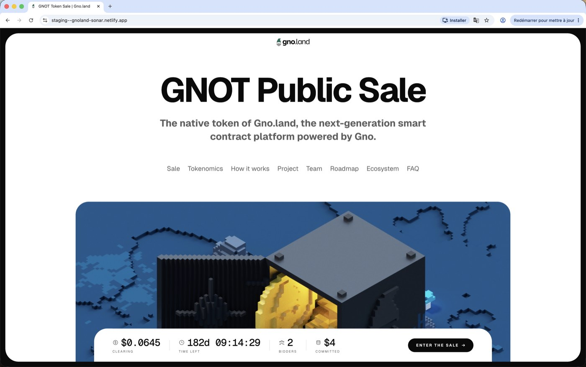

## 2. Start the verification

The panel expands on step **1 VERIFY**. Click **VERIFY WITH SONAR**. You will be redirected to Echo's site (Sonar is Echo's compliance service).

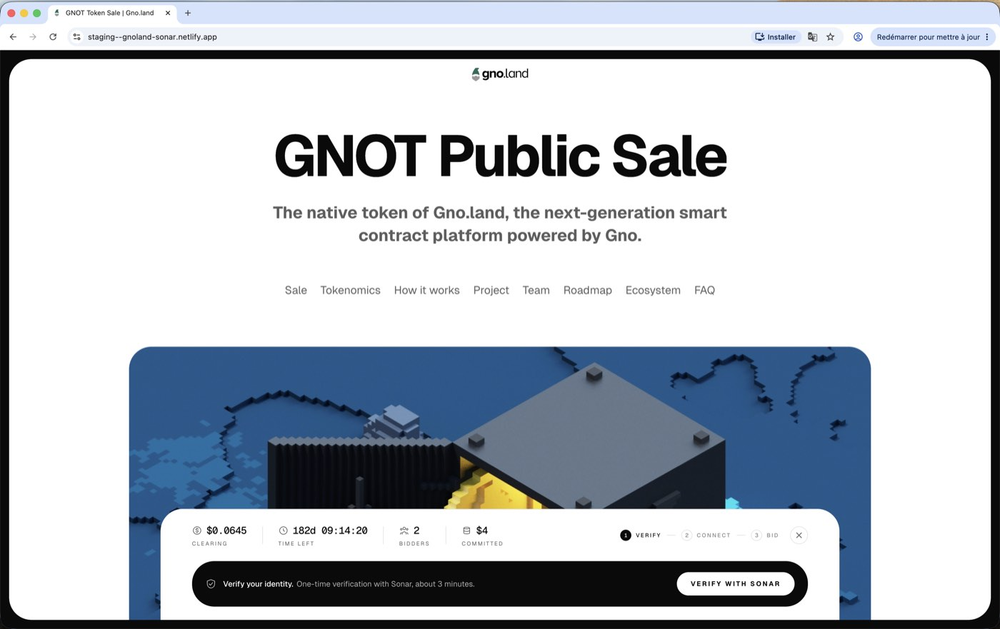

## 3. Log in or create an Echo account

You land on `app.echo.xyz`. If you already have an Echo/Sonar account, log in (Google, Passkey or email). If not, click **Create an account** at the bottom.

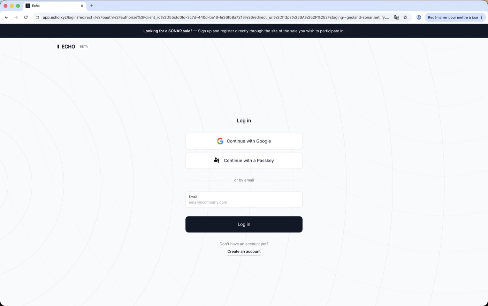

## 4. Sign up with your email

Enter your email address (or use **Continue with Google**) and click **Sign up**. Echo will send you a verification code or link - check your inbox and follow it.

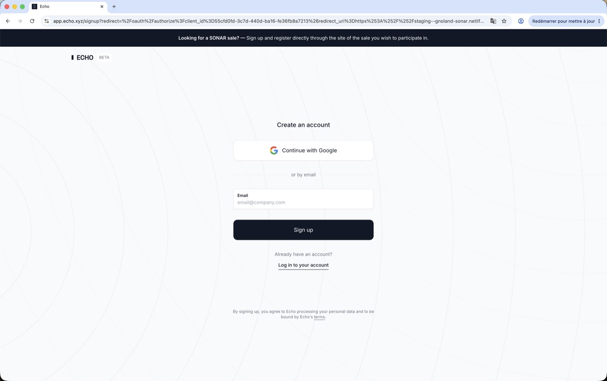

Example with a work email:

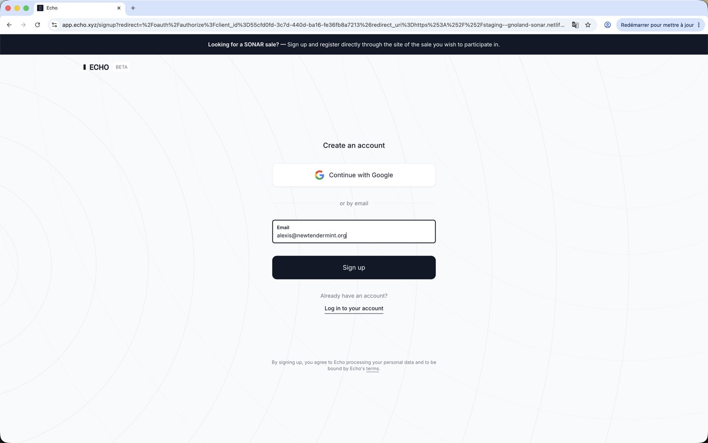

## 5. One account per person

If this popup appears, click **Create a new account** ONLY if you truly have no Echo/Sonar account yet. Duplicate accounts get banned by Echo. If in doubt, click **Go back and login**.

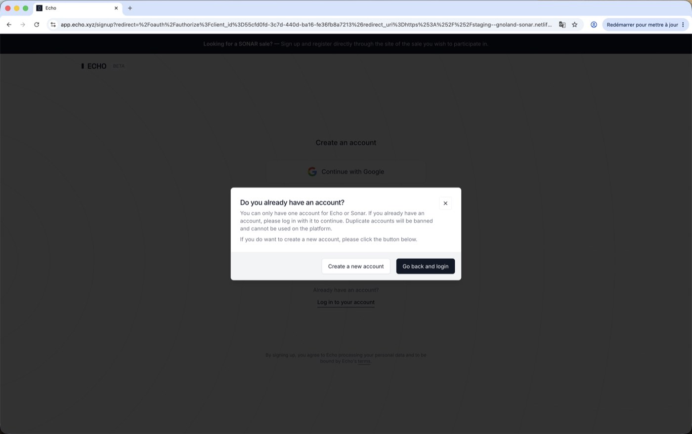

## 6. Authorize the sale site

Sonar now asks you to authorize **All in Bits Inc. Sale** to read your verification data. The yellow banner "This is a test sale" is expected - it confirms you are on the sandbox. Scroll down and click **Authorize**.

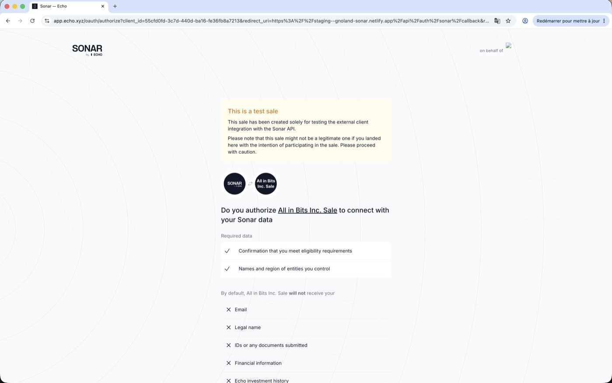

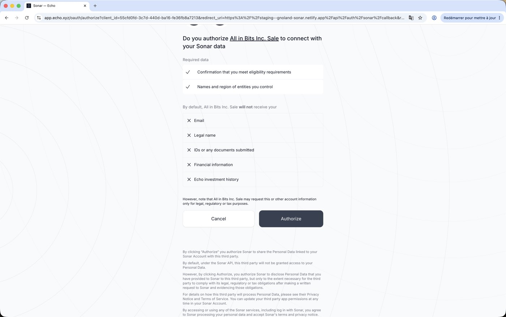

## 7. Set up your investing entity on Sonar

After authorizing, open the Sonar setup page for our sale (if it did not open automatically):

`https://app.echo.xyz/sonar/c4b494ad-2f27-46fa-bbd2-c6b0bdd74887/home`

You should see "Welcome to Sonar" and the yellow **Sale integration sandbox** banner. Under "How will you be investing?", click **As yourself**.

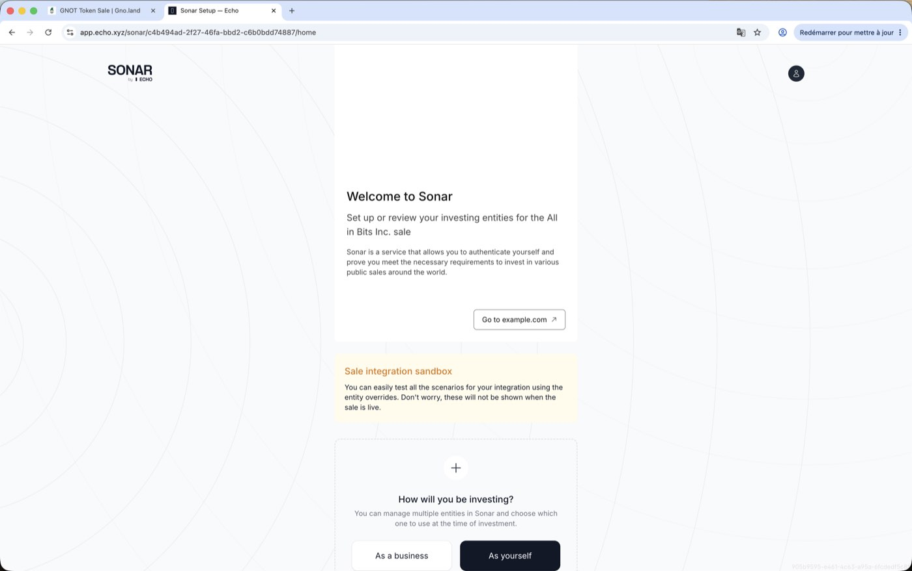

## 8. Pick a country of residence

In the "Add yourself as an investor" modal, select any **Country of residence** (it is a sandbox - the value does not matter for testing) and click **Next**.

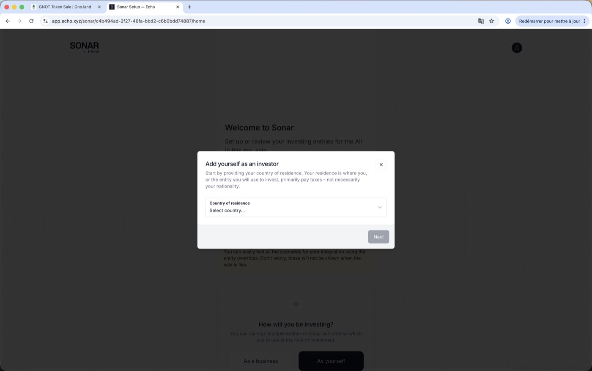

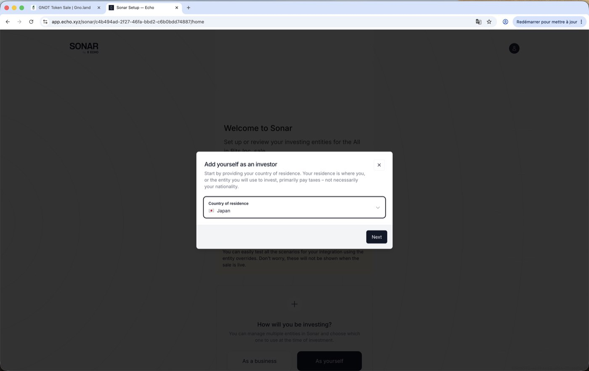

## 9. Your entity is created - do NOT start the real KYC

Your entity now appears under **Investing Entities** ("Name not provided - Yourself"). Ignore the **Start** buttons for "Complete identity verification": that is the real KYC flow and it is not needed on the sandbox.

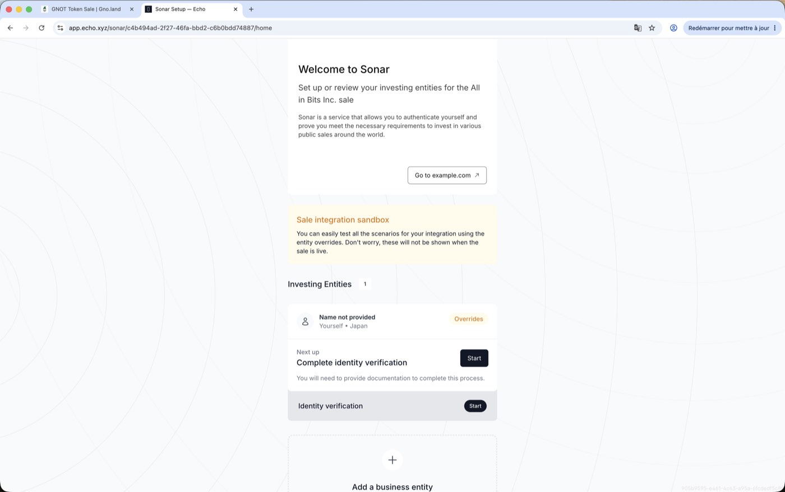

## 10. Open the Overrides panel

On your entity card, click the orange **Overrides** chip (top right of the card). This panel only exists on test sales.

## 11. Apply the "Ready for purchase" preset

In the **Test Overrides** modal, open **Quick preset**, choose **Ready for purchase**, then click **Save**. This marks your entity as fully verified and eligible in one go (it may also set the country to United States - that is fine).

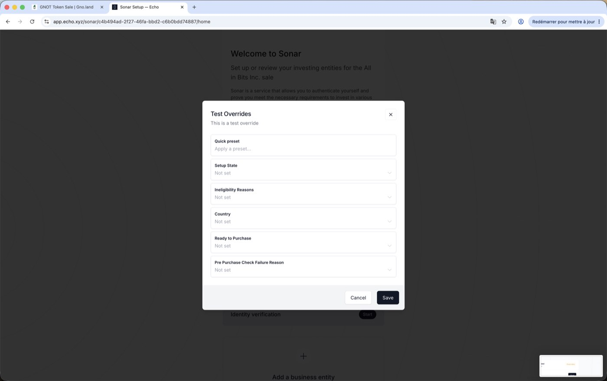

## 12. Check the result

The preset options look like this when applied:

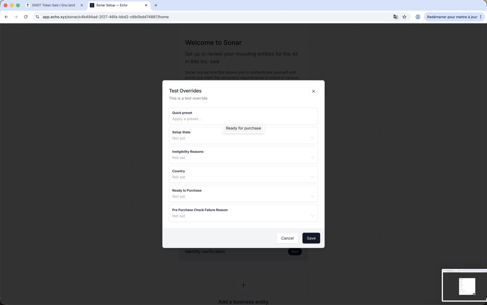

Your entity card should now read **Qualified for this sale**, with "Identity verification - Done" and "Accredited investor status - Done".

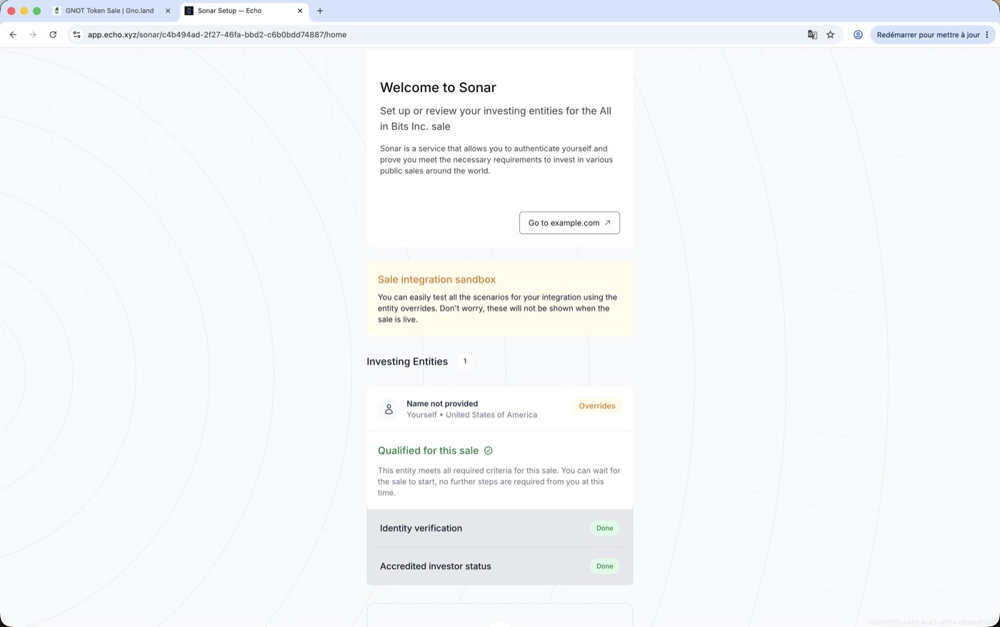

## 13. Back to the sale site - you are verified

Return to the staging tab and **reload the page** (Cmd+R; hard refresh Cmd+Shift+R if needed). The bar should now be on step **2 CONNECT**: "Connect your wallet". From here, connect **MetaMask** on **Sepolia** to place a test bid.

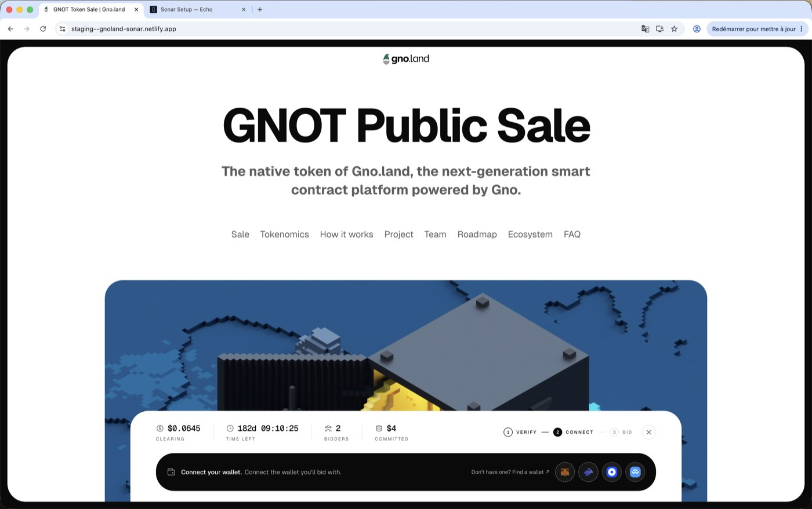

## Troubleshooting

- **The site shows "Welcome back / Reconnect" right after you come back from Sonar:** known issue - Sonar's state can take a moment to propagate. Wait ~30 seconds and reload; if it persists, click Reconnect once (it re-authenticates without redoing anything). A fix is being deployed.
- **"Verification failed / Contact support":** your entity is in a failed state on Sonar. Open the Overrides panel (steps 10-11) and apply the "Ready for purchase" preset, then reload the sale site.
- **The Sonar page says "verification failed" right after Authorize:** same fix - you skipped the entity setup; do steps 7 to 12.
- **Bidding fails with Keplr:** use MetaMask. Keplr ignores the gas limit our dapp requests and the transaction runs out of gas.
